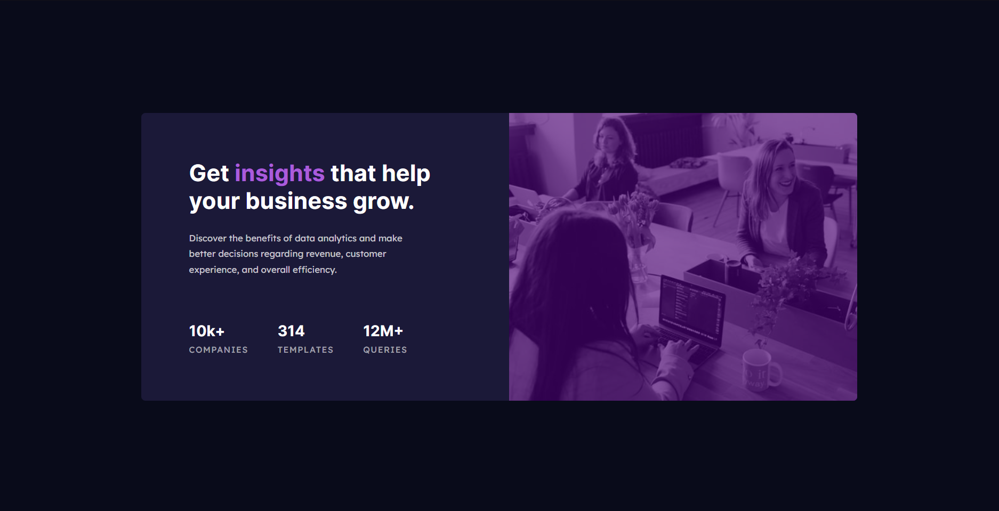
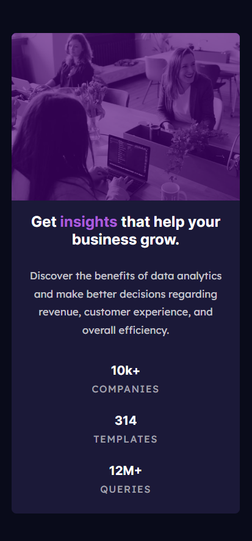

# Frontend Mentor - Interactive rating component solution

This is a solution to the [Stats preview card challenge on Frontend Mentor](https://www.frontendmentor.io/challenges/stats-preview-card-component-8JqbgoU62). Frontend Mentor challenges help you improve your coding skills by building realistic projects.

[Solution][solution-url] . [Live Page][live-page]

Table of contents

-   [Overview](#overview)
    -   [The challenge](#the-challenge)
    -   [Screenshots](#screenshots)
    -   [Links](#links)
-   [My process](#my-process)
    -   [Built with](#built-with)
    -   [Useful resources](#useful-resources)
-   [Author](#author)

## Overview

### The challenge

Users should be able to:

-   View the optimal layout for the app depending on their device's screen size
-   See hover states for all interactive elements on the page

### Screenshots

<table>
        <tr>
            <td>
                
            </td>
            <td>
                
            </td>
        </tr>
</table>

### Links

-   [Solution][solution-url]
-   [Live Page][live-page]

## My process

### Built with

-   Semantic HTML5 markup
-   CSS custom properties
-   Flexbox

(<a href="#top">back to top</a>)

### Useful resources

-   [Font Size](https://www.w3schools.com/css/css_font_size.asp)
-   [Picture](https://www.w3schools.com/tags/tryit.asp?filename=tryhtml5_picture)
-   [Max-width](https://ishadeed.com/article/min-max-css/#using-min-width-and-max-width)
-   [Div order](https://stackoverflow.com/questions/32829567/change-div-order-with-css-depending-on-device-width)

(<a href="#top">back to top</a>)

## Author

-   Frontend Mentor - [link](https://www.frontendmentor.io/profile/JCzyszczon)

(<a href="#top">back to top</a>)

[live-page]: https://jczyszczon.github.io/stats-preview-card/
[solution-url]: https://www.frontendmentor.io/solutions/responsive-interactive-rating-component-IH9xZTW7kw
